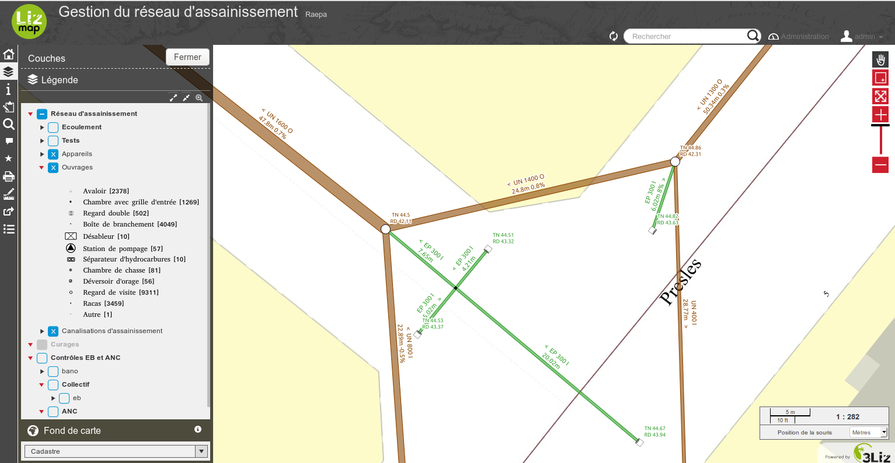

# RAEPA

Plugin QGIS pour le standard Réseaux d'Adduction d'Eau Potable et d'Assainissement (RAEPA)

## Installation

Dans le gestionnaire des extensions de QGIS, vous pouvez ajouter un dépôt avec l'URL suivante : 

https://github.com/3liz/qgis-raepa-plugin/releases/latest/download/plugins.xml

## Présentation

Lizmap Web Client:

QGIS Plugin:

## Documentation

Database documentation : https://3liz.github.io/qgis-raepa-plugin/

## Financeurs

* Communauté d'Agglomération du Soissonnais
* Régie du SDDEA
* Eau d'Excellence Guadeloupe

## Contributeurs

* Michaël Douchin (3liz)  @mdouchin

## Licence

GPL V2
