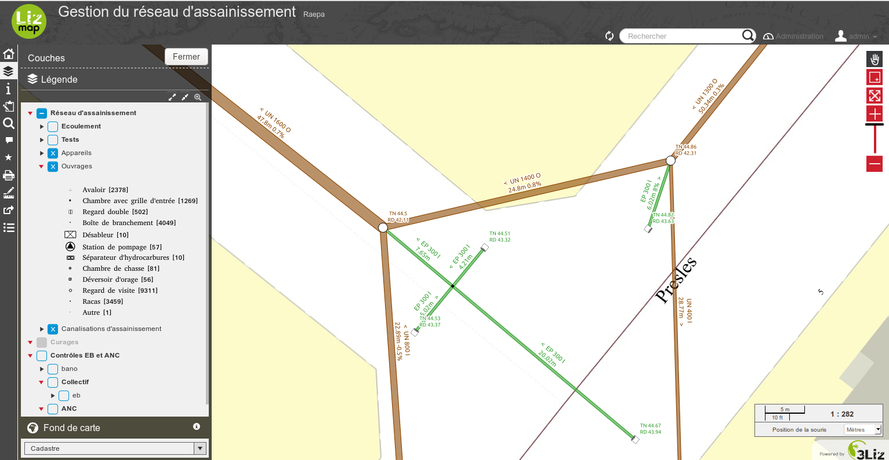
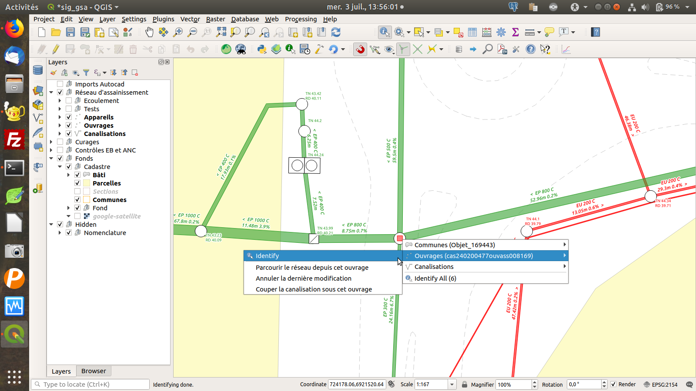

---
hide:
  - navigation
  - toc
---

# Standard RAEPA

Extension QGIS pour le standard Réseaux d'Adduction d'Eau Potable et d'Assainissement
[RAEPA](http://www.geoinformations.developpement-durable.gouv.fr/geostandard-reseaux-d-adduction-d-eau-potable-et-d-a3478.html)

<!--  -->

Lizmap Web Client:

Extension QGIS:

