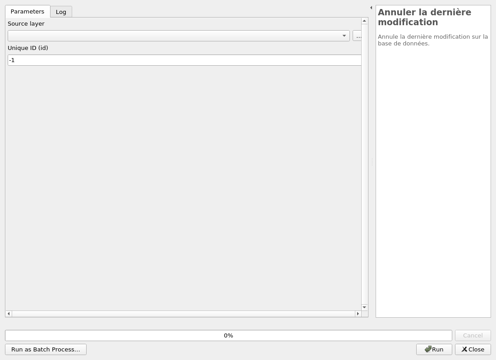
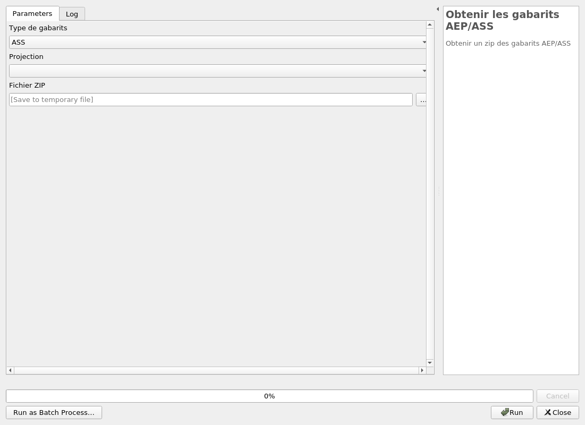
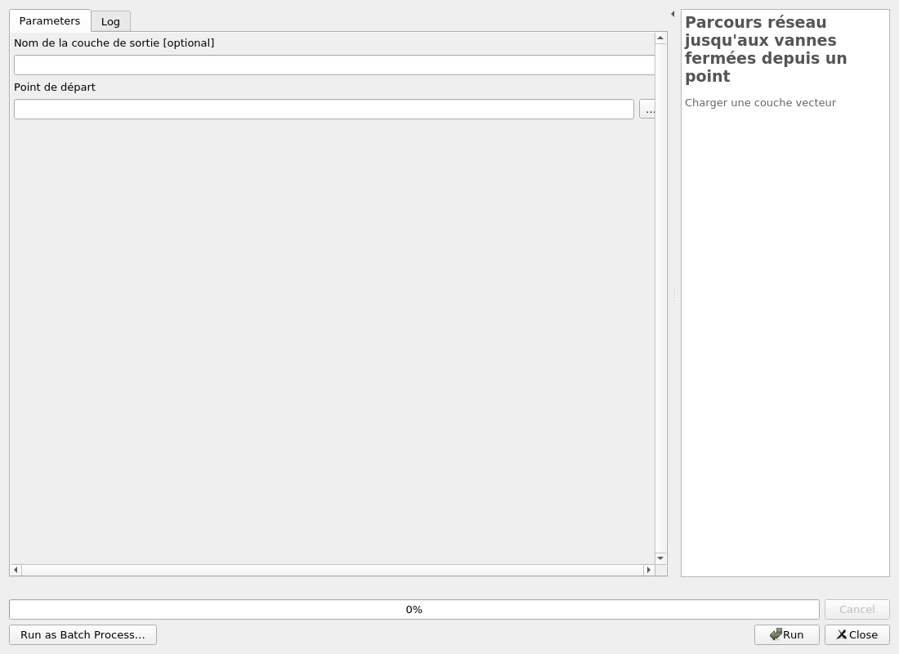
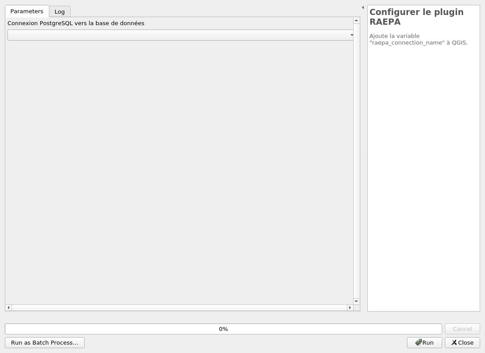
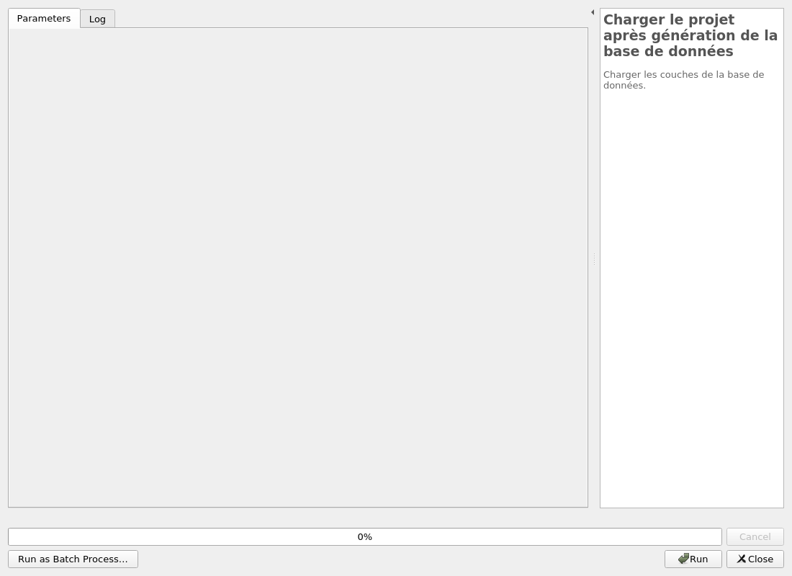
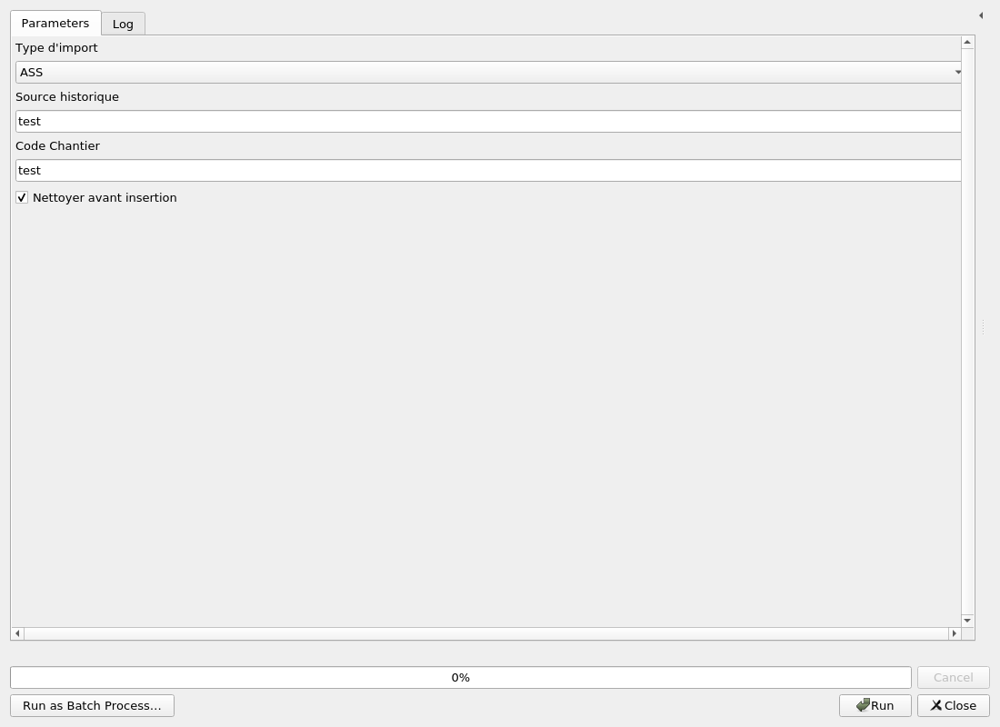
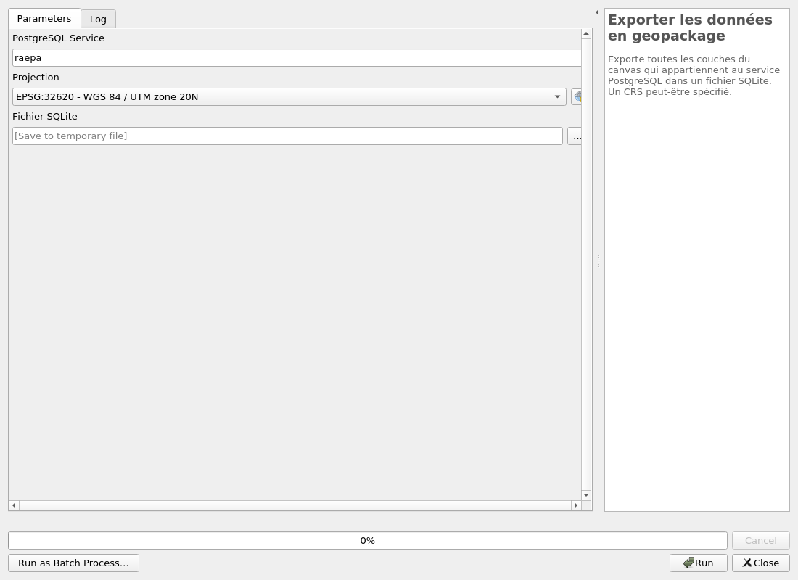

---
hide:
  - navigation
---

# Processing

## Outils

### Ajouter des vues SQL

Ajouter des requêtes SQL dans le canevas.

Ces requêtes sont des fichiers dans le plugin.

#### Parameters

| ID | Description | Type | Info | Required | Advanced | Option |
|:-:|:-:|:-:|:-:|:-:|:-:|:-:|
FILES|Requêtes|Enum||✓||Values: Culs de sac  |

#### Outputs

| ID | Description | Type | Info |
|:-:|:-:|:-:|:-:|
OUTPUT|Sortie|MultipleLayers||

***

### Annuler la dernière modification

Annule la dernière modification sur la base de données.

#### Parameters

| ID | Description | Type | Info | Required | Advanced | Option |
|:-:|:-:|:-:|:-:|:-:|:-:|:-:|
SOURCE_LAYER|Source layer|VectorLayer||✓||Type:   |
SOURCE_ID|Unique ID (id)|String||✓||Default: -1   |

#### Outputs

| ID | Description | Type | Info |
|:-:|:-:|:-:|:-:|
OUTPUT_STATUS|Statut de sortie|Number||
OUTPUT_STRING|Message de sortie|String||

***

### Execute SQL

Exécuter du SQL dans la base de données.

#### Parameters

| ID | Description | Type | Info | Required | Advanced | Option |
|:-:|:-:|:-:|:-:|:-:|:-:|:-:|
INPUT_SQL|INPUT_SQL|String|||||

#### Outputs

| ID | Description | Type | Info |
|:-:|:-:|:-:|:-:|
OUTPUT_STATUS|Statut de sortie|Number||
OUTPUT_STRING|Message de sortie|String||

***

### Obtenir les gabarits AEP/ASS

Obtenir un zip des gabarits AEP/ASS

#### Parameters

| ID | Description | Type | Info | Required | Advanced | Option |
|:-:|:-:|:-:|:-:|:-:|:-:|:-:|
TYPE|Type de gabarits|Enum||✓||Values: ASS, AEP  |
CRS|Projection|Enum||✓||Values: EPSG:2154, EPSG:32620  |
DESTINATION|Fichier ZIP|FileDestination||✓|||

#### Outputs

| ID | Description | Type | Info |
|:-:|:-:|:-:|:-:|
DESTINATION|Fichier ZIP|File||

***

### Récupération réseau aval

Obtenir le réseau en aval d'un ouvrage

#### Parameters

| ID | Description | Type | Info | Required | Advanced | Option |
|:-:|:-:|:-:|:-:|:-:|:-:|:-:|
OUTPUT_LAYER_NAME|Nom de la couche de sortie|String|||||
SOURCE_ID|Unique ID (idouvrage)|String||✓||Default: -1   |
METHOD|Méthode|Enum||✓||Values: geom, attribute  |

#### Outputs

| ID | Description | Type | Info |
|:-:|:-:|:-:|:-:|
OUTPUT_STATUS|Statut de sortie|Number||
OUTPUT_STRING|Message de sortie|String||
OUTPUT_LAYER|Couche de sortie|VectorLayer||
OUTPUT_LAYER_RESULT_NAME|Nom de la couche de sortie|String||

***

### Réseau vers une vanne

Charger une couche vecteur

#### Parameters

| ID | Description | Type | Info | Required | Advanced | Option |
|:-:|:-:|:-:|:-:|:-:|:-:|:-:|
OUTPUT_LAYER_NAME|Nom de la couche de sortie|String|||||
SOURCE_ID|Unique ID (idcana)|String||✓||Default: -1   |

#### Outputs

| ID | Description | Type | Info |
|:-:|:-:|:-:|:-:|
OUTPUT_STATUS|Statut de sortie|Number||
OUTPUT_STRING|Message de sortie|String||
OUTPUT_LAYER|Couche de sortie|VectorLayer||
OUTPUT_LAYER_RESULT_NAME|Nom de la couche de sortie|String||

***

### Parcours réseau jusqu'aux vannes fermées depuis un point

Charger une couche vecteur

#### Parameters

| ID | Description | Type | Info | Required | Advanced | Option |
|:-:|:-:|:-:|:-:|:-:|:-:|:-:|
OUTPUT_LAYER_NAME|Nom de la couche de sortie|String|||||
POINT|Point de départ|Point||✓|||

#### Outputs

| ID | Description | Type | Info |
|:-:|:-:|:-:|:-:|
OUTPUT_STATUS|Statut de sortie|Number||
OUTPUT_STRING|Message de sortie|String||
OUTPUT_LAYER|Couche de sortie|VectorLayer||
OUTPUT_LAYER_RESULT_NAME|Nom de la couche de sortie|String||

***

### Parcours réseau jusqu'aux vannes depuis un point

Charger une couche vecteur

#### Parameters

| ID | Description | Type | Info | Required | Advanced | Option |
|:-:|:-:|:-:|:-:|:-:|:-:|:-:|
OUTPUT_LAYER_NAME|Nom de la couche de sortie|String|||||
POINT|Point de départ|Point||✓|||

#### Outputs

| ID | Description | Type | Info |
|:-:|:-:|:-:|:-:|
OUTPUT_STATUS|Statut de sortie|Number||
OUTPUT_STRING|Message de sortie|String||
OUTPUT_LAYER|Couche de sortie|VectorLayer||
OUTPUT_LAYER_RESULT_NAME|Nom de la couche de sortie|String||

***

### Orientation appareil

Obtenir l'orientation d'un appareil.

#### Parameters

| ID | Description | Type | Info | Required | Advanced | Option |
|:-:|:-:|:-:|:-:|:-:|:-:|:-:|
SOURCE_ID|Unique ID (idappareil)|String||✓||Default: -1   |

#### Outputs

| ID | Description | Type | Info |
|:-:|:-:|:-:|:-:|
OUTPUT_STATUS|Statut de sortie|Number||
OUTPUT_STRING|Message de sortie|String||

***

### Récupération réseau amont

Obtenir le réseau en amont d'un ouvrage

#### Parameters

| ID | Description | Type | Info | Required | Advanced | Option |
|:-:|:-:|:-:|:-:|:-:|:-:|:-:|
OUTPUT_LAYER_NAME|Nom de la couche de sortie|String|||||
SOURCE_ID|Unique ID (idouvrage)|String||✓||Default: -1   |
METHOD|Méthode|Enum||✓||Values: geom, attribute  |

#### Outputs

| ID | Description | Type | Info |
|:-:|:-:|:-:|:-:|
OUTPUT_STATUS|Statut de sortie|Number||
OUTPUT_STRING|Message de sortie|String||
OUTPUT_LAYER|Couche de sortie|VectorLayer||
OUTPUT_LAYER_RESULT_NAME|Nom de la couche de sortie|String||

***

## Configuration

### Charger les styles des couches

Ajoute les styles et/ou les actions par défaut pour chacune des couches.

#### Parameters

| ID | Description | Type | Info | Required | Advanced | Option |
|:-:|:-:|:-:|:-:|:-:|:-:|:-:|
APPARAEP|Couche Appareil AEP|VectorLayer||||Type: TypeVectorPoint  |
APPARASS|Couche Appareil ASS|VectorLayer||||Type: TypeVectorPoint  |
OUVRAEP|Couche Ouvrage AEP|VectorLayer||||Type: TypeVectorPoint  |
OUVRASS|Couche Ouvrage ASS|VectorLayer||||Type: TypeVectorPoint  |
CANALAEP|Couche Canalisation AEP|VectorLayer||||Type: TypeVectorLine  |
CANALASS|Couche Canalisation ASS|VectorLayer||||Type: TypeVectorLine  |
STYLETYPE|Importer uniquement les actions|Enum||✓||Default: [1, 2]   Values: Tout, Actions, Forms  |

#### Outputs

| ID | Description | Type | Info |
|:-:|:-:|:-:|:-:|
No output

***

### Configurer le plugin RAEPA

Ajoute la variable "raepa_connection_name" à QGIS.

#### Parameters

| ID | Description | Type | Info | Required | Advanced | Option |
|:-:|:-:|:-:|:-:|:-:|:-:|:-:|
CONNECTION_NAME|Connection PostgreSQL à la base à RAEPA|String||✓|||

#### Outputs

| ID | Description | Type | Info |
|:-:|:-:|:-:|:-:|
OUTPUT_STATUS|Statut de sortie|Number||
OUTPUT_STRING|Message de sortie|String||

***

### Charger le projet après génération de la base de données

Charger les couches de la base de données.

#### Parameters

| ID | Description | Type | Info | Required | Advanced | Option |
|:-:|:-:|:-:|:-:|:-:|:-:|:-:|
RIEN|Champ qui ne sert à rien|String|||||

#### Outputs

| ID | Description | Type | Info |
|:-:|:-:|:-:|:-:|
OUTPUT_STRING|Message de sortie|String||
OUTPUT_LAYERS|Couches de sortie|MultipleLayers||

***

## Import

### 02 Conversion données importées dans le modèle RAEPA

#### Parameters

| ID | Description | Type | Info | Required | Advanced | Option |
|:-:|:-:|:-:|:-:|:-:|:-:|:-:|
ANNEE_FIN_POSE|Année de fin de pose|String||✓||Default: 2018   |
QUALITE_XY|Qualité XY|String||✓||Default: A   |
QUALITE_Z|Qualité Z|String||✓||Default: A   |
ETAT|État|String||✓||Default: 00   |
SOURCE_HISTORIQUE|Source historique|String||✓||Default: test   |
CODE_CHANTIER|Code Chantier|String||✓||Default: test   |

#### Outputs

| ID | Description | Type | Info |
|:-:|:-:|:-:|:-:|
OUTPUT_STATUS|Statut de sortie|Number||
OUTPUT_STRING|Message de sortie|String||

***

### 01 Import des SHP dans les tables temporaires

Import des données vecteurs dans la base de données PostGIS.

#### Parameters

| ID | Description | Type | Info | Required | Advanced | Option |
|:-:|:-:|:-:|:-:|:-:|:-:|:-:|
APPAREILS|Appareils|VectorLayer||✓||Type:   |
CANALISATIONS|Canalisations|VectorLayer||✓||Type:   |
OUVRAGES|Ouvrages|VectorLayer||✓||Type:   |

#### Outputs

| ID | Description | Type | Info |
|:-:|:-:|:-:|:-:|
OUTPUT_STATUS|Statut de sortie|Number||
OUTPUT_STRING|Message de sortie|String||

***

### 03 Insertion données converties

#### Parameters

| ID | Description | Type | Info | Required | Advanced | Option |
|:-:|:-:|:-:|:-:|:-:|:-:|:-:|
SOURCE_HISTORIQUE|Source historique|String||✓||Default: test   |
CODE_CHANTIER|Code Chantier|String||✓||Default: test   |
NETTOYER_AVANT_INSERTION|Nettoyer avant insertion|Boolean||✓||Default: True   |

#### Outputs

| ID | Description | Type | Info |
|:-:|:-:|:-:|:-:|
OUTPUT_STATUS|Statut de sortie|Number||
OUTPUT_STRING|Message de sortie|String||

***

## Structure

### Création de la structure BDD

Crée la base de données avec les schémas et les tables.

#### Parameters

| ID | Description | Type | Info | Required | Advanced | Option |
|:-:|:-:|:-:|:-:|:-:|:-:|:-:|
OVERRIDE|Écraser les schémas raepa,audit et import et toutes les données ? ** ATTENTION **|Boolean||✓|||
ADD_AUDIT|Ajouter un audit de suivi des modifications sur les tables ?|Boolean||✓||Default: True   |
SRID|Projection des géométries|Crs||✓||Default: EPSG:2154   |
NOM|Nom du gestionnaire|String||✓||Default: Communauté d'Agglomération de Test   |
SIREN|SIREN|String||✓||Default: 123456789   |
CODE|Nom abbrégé en 3 caractères|String||✓||Default: cat   |

#### Outputs

| ID | Description | Type | Info |
|:-:|:-:|:-:|:-:|
OUTPUT_STATUS|Statut de sortie|Number||
OUTPUT_STRING|Message de sortie|String||

***

### Mise à jour de la structure de la BDD

Applique les migrations SQL nécéssaires sur la base de données. Cela est à faire lors d'une mise à jour du plugin.

#### Parameters

| ID | Description | Type | Info | Required | Advanced | Option |
|:-:|:-:|:-:|:-:|:-:|:-:|:-:|
RUN_MIGRATIONS|Cocher cette case pour faire la mise à jour. Autrement, aucune action ne se passera.|Boolean||✓|||
SRID|Projection des géométries|Crs||✓||Default: EPSG:2154   |

#### Outputs

| ID | Description | Type | Info |
|:-:|:-:|:-:|:-:|
OUTPUT_STATUS|Statut de sortie|Number||
OUTPUT_STRING|Message de sortie|String||

***

## Export

### Exporter les données en geopackage

Exporte toutes les couches du canvas qui appartiennent au service PostgreSQL dans un fichier SQLite. Un CRS peut-être spécifié.

#### Parameters

| ID | Description | Type | Info | Required | Advanced | Option |
|:-:|:-:|:-:|:-:|:-:|:-:|:-:|
PGSERVICE|PostgreSQL Service|String||✓||Default: raepa   |
SRID|Projection|Crs||✓||Default: EPSG:32620   |
DESTINATION|Fichier SQLite|FileDestination||✓|||

#### Outputs

| ID | Description | Type | Info |
|:-:|:-:|:-:|:-:|
DESTINATION|Fichier SQLite|File||

***

