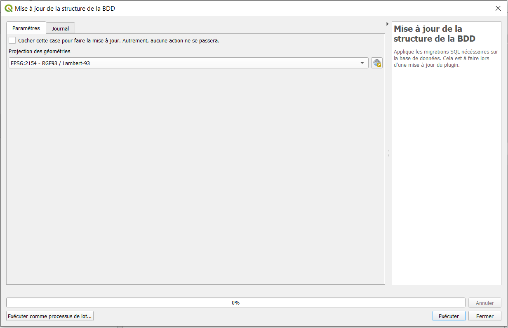

#Configuration
Tous les outils évoqués dans cette page sont accessible via l'onglet `Config` du [Panneau RAEPA](../Panel/).
##__1. Installation de la base__

###__1.1. Configurer la connexion à la base__

Pour commencer, il faut définir dans quelle base donnée le schéma RAEPA va être enregistré. Pour cela on va utiliser l'outil `Configurer la connexion à la base` qui permet de choisir
la connexion a la base de données dans laquelle se trouve (où va se trouver) le schéma RAEPA. L’outil vous propose de choisir parmi toutes les connexions [Postgis](https://docs.qgis.org/3.10/fr/docs/training_manual/databases/db_browser.html) que vous avez créées dans votre logiciel QGIS.  

Il y a ensuite deux options :  
    -Le schema n'existe pas encore dans la base de données : référez-vous à [1.2. Installation de la base](#12-installation-de-la-base)  
    -Le schema RAEPA existe déjà dans la base de données : référez-vous à [1.3. Mise à jour de la base](#13-mise-a-jour-de-la-base)

###__1.2. Installation de la base__

_**Pour utiliser cet outil vous devez vous connecter à la base de donnée en tant que super-utilisateur**_
 Pour installer (ou réinstaller) la base de données, utilisez l'outil `installation de la base`:

Paramètres d'entrée :  
-`Écraser les schémas raepa, audit et import et toutes les données ?` : Permet, si le schéma RAEPA existe déjà dans la base, de l’écraser afin de recréer un Schéma vierge.  
**ATTENTION** : toutes les données présentes dans le-dis schéma seront supprimées  
-`Ajouter un audit de suivi des modifications sur les tables` : Met en place des triggers afin d’analyser et contrôler les actions effectuées sur la base. Met en place un 'historique' des actions effectuées sur la base 
-`Projection des géométries` : Défini la projection dans laquelle les géométries vont être enregistrées dans la base de données.  
-`Nom du gestionnaire` : Défini le nom du gestionnaire de la BDD.  
-`SIREN` : Numéro de SIREN du gestionnaire.  
-`Nom abrégé en 3 caractères` : Abréviation en 3 caractères du nom de gestionnaire.  

Après l'exécution de ce script, vous avez installé, dans la base de données définie avec l’outil [Configurer la connexion à la base](#configurer-la-connexion-a-la-base), 
un nouveau schéma contenant toutes les tables du standard RAEPA et tous les éléments qui leurs sont associé (fonctions…).
Vous pouvez maintenant [configurer un projet Qgis](#2-configuration-du-projet-qgis) à partir des tables de la base de données.

###__1.3. Mise à jour de la base__

Pour mettre à jour la base de données, utilisez l'outil `Mise à jour de la base`
(Cet outil n'est utile que lors d'un changement de version du plugin) :

Pour que les mises à jour soient appliquées, cochez la case `Cocher cette case pour faire la mise à jour`, vous avez aussi la possibilité 
de choisir la projection dans laquelle les géométries sont enregistrées dans la base.  
Une fois les mises à jour effectuées, vous pouvez [configurer un projet Qgis](#2-configuration-du-projet-qgis) à partir des tables de la base de données.

##__2. Configuration du projet Qgis__

###__2.1. Charger le projet__

Pour configurer le projet Qgis, commencez par utiliser l'outil `Charger le projet`, celui-ci va ajouter dans votre projet Qgis actuel (vierge ou non) 
toutes les tables du schéma RAEPA de la base de données sous forme de couches. 

 La prochaine étape va être d'appliquer des [styles](#22-charger-les-styles) à ces couches.

###__2.2. Charger les styles__

Après avoir charger les couches dans le projet, vous pouvez leur appliquer des styles afin de simplifier leur utilisation, et celle du plugin. 
Pour cela utilisez l'outil `Charger les styles`.
  Cet outil va vous demander d'associer les couches présentes dans votre projet aux style qui lui correspondent 
(ATTENTION, la nomenclature des couches provenant de la base de données est une nomenclature abrégée. Par exemple pour la couches des appareils d'assainissement
le nom sera __apparass__).
  Le dernier paramètre, lui, permet de définir quels sont les types de style que vous souhaitez ajouter :

-Si vous sélectionnez `Actions` : Vous allez ajouter des actions possible sur les différentes couches du projet. L'utilité des actions
est précisément décrite dans la page [Actions](../Actions/)

-Si vous sélectionnez `Forms` : Vous allez ajouter des formulaires aux différents couches, ceux-ci permettent de simplifier l'ajout de 
nouveaux objets et/ou la modification des attributs des objets déjà existants. 

-Si vous sélectionnez `Tout` : Vous allez ajouter non seulement les `Actions` et les `Forms` mais aussi toute une symbologie pour les
différents objets de chaque couche ce qui rend la carte plus lisible et claire.

##__3. Aide__

###__3.1. Modèle conceptuel de données__

Le bouton `Modèle conceptuel de données` renvoie vers le [modèle de données](https://3liz.github.io/qgis-raepa-plugin/database) disponible en ligne afin de comprendre l'architecture de la base. 