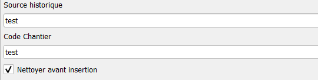
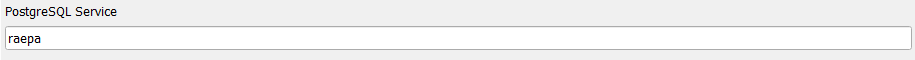

#Import-Export

Lorsque ce n'est pas précisé, les outils évoqués dans cette page sont accessible via l'onglet `Import/Export` du [Panneau RAEPA](../Panel/).

##__1. Import__

Maintenant que votre base de données et votre projet sont bien installés, vous allez sûrement vouloir y insérer des données.

###__1.1 Obtenir les gabarits AEP/ASS__

Pour commencer, la donnée que vous souhaitez ajouter doit être dans le standard RAEPA, et plus particulièrement au niveau des noms des champs
c'est pourquoi, pour construire la nouvelle donnée, il est recommandé d'utiliser les Gabarits fournis par l'outil [`Obtenir les gabarits AEP/ASS`](../Outils/#2-obtenir-les-gabarits-aepass).
  /!\ La plupart des champs sont nécessaires au bon fonctionnement des outils qui suivent. Veillez à bien tous les remplir !

###__1.2 Import shapefiles dans les tables temporaires__

Une fois que votre donnée a été construite à l'aide des gabarits, vous allez utiliser l'outil `Import shapefiles dans les tables temporaires` pour importer
les objets dans la base de données.
  L'outil va vous demander quelles sont les couches que vous souhaitez importer, il vous suffit de faire correspondre les shapefiles que vous souhaitez ajouter avec le nom des couches.

Après avoir exécuté cet algorithme, les données sont enregistrées dans la base, mais elles ne sont pas encore dans les tables du schéma RAEPA (la ou nous voulons les y enregistrer).
Pour cela il faut d'abord les [convertir](#13-convertisseur-des-donnees).

###__1.3 Convertisseur des données__

Maintenant que vos données sont dans la base, l'outil `Convertisseur de données` leur ajoute les métadonnées RAEPA et s'assure qu'elles
rentrent bien dans le standard RAEPA.

Paramètres d'entrée :
 -`Année de fin de pose` : Année durant laquelle on à fini de poser les objets
 -`Qualité XY` : Qualité de la géolocalisation des objets selon les axes X et Y (voir [Standard](http://www.geoinformations.developpement-durable.gouv.fr/geostandard-reseaux-d-adduction-d-eau-potable-et-d-a3674.html))
 -`Qualité Z` : Qualité de la géolocalisation des objets selon l’axe Z (voir [Standard](http://www.geoinformations.developpement-durable.gouv.fr/geostandard-reseaux-d-adduction-d-eau-potable-et-d-a3674.html))
 -`État` : État des objets (Hors Standard RAEPA)
 -`Source historique` : Permet de fournir la source historique des données à convertir.
 -`Code Chantier` : Permet de fournir le code du chantier des données ajoutées.
 -D'autres données potentiellement manquante tel que la date de mise à jour seront ajoutées automatiquement par le `Convertisseur de données`.

Une fois que les données sont converties, il ne reste plus qu'à les [insérer](#14-insertion-des-donnees-converties) dans le schéma RAEPA.

###__1.4 Insertion des données converties__

Maintenant que vos données sont converties dans le standard RAEPA, Il ne vous reste plus qu'à utiliser l'outil `Insertion des données converties` pour finaliser
votre importation.

  Cet outil vous permet aussi, avant d'insérer les nouvelles données, de supprimer les données dont le `code_chantier` et la `source_historique`
sont similaire a ceux que vous renseignez. Et cela dans le but d'éviter les doublons dans le cas ou vous importeriez deux fois le même chantier, 
après une modification des données par exemple.

##__2. Export__

###__2.1 Exporter les données en Geopackage__

Maintenant que vous avez des données dans votre base, vous allez peut-être avoir besoin de les exporter. Pour cela, il suffit d'utiliser l'outil
`Exporter les données en Geopackage`, et de choisir un fichier de sortie pour y enregistrer vos données ainsi que la projection dans laquelle vous voulez
enregistrer les géométries.

Pour ce qui est du paramètre `PostgreSQL Service`, c'est un service de connexion à la base de donnée que l'outil utilise pour y extraire les données à exporter.
Pour plus d'information, consultez la [documentation Postgres](https://docs.postgresql.fr/10/libpq-pgservice.html).