#Outils

Maintenant que votre base contient des données et que votre projet qgis est bien configuré, 
le plugin fournit un certain nombre d'outils pour le traitement et l'analyse des réseaux humides. 

##1. Obtenir les gabarits AEP/ASS

Le bouton `Obtenir les gabarits AEP/ASS` permet de récupérer, dans un fichier `.zip`, les gabarits des différentes couches du standard :

Vous pouvez choisir entre les gabarits pour l'assainissement (ASS) ou l'adduction d'eau potable (AEP) ainsi que leur projection.
Vous pouvez aussi choisir le nom du fichier de sortie.

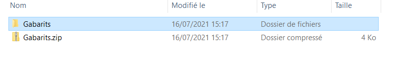

##2. Orientation d'un appareil

`Orientation d'un appareil` permet de calculer l'orientation de la canalisation support de l'appareil cible, l'interet est de pouvoir orienter
le symbole de l'appareil pour qu'il colle à la canalisation.

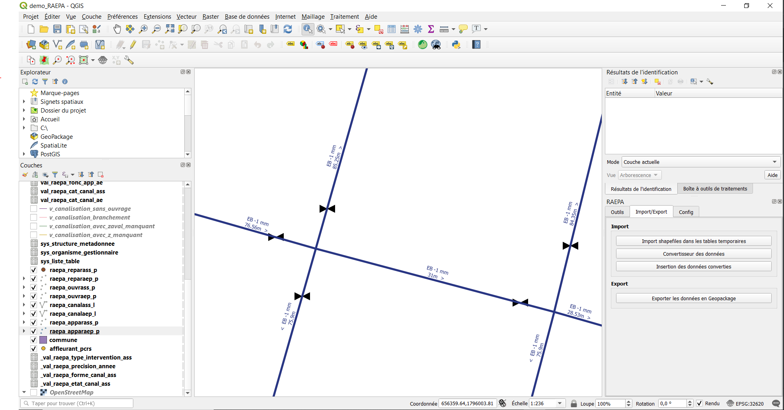

Ces appareils ne sont pas orientés, vous pouvez utiliser `Orientation d'un appareil` pour calculer leur orientation.
Pour cela vous avez besoin de connaitre leur identifiant (ou d'utiliser une de leur [Actions](../Actions/)) grace à l'outil 
`identifier les entités`  ou la `table d'attribut` .

Après avoir renseigné l'indentifiant des appareils (idappareil), lancez l'algorithme pour chacun de ceux-ci, et vous obtenez ceci :

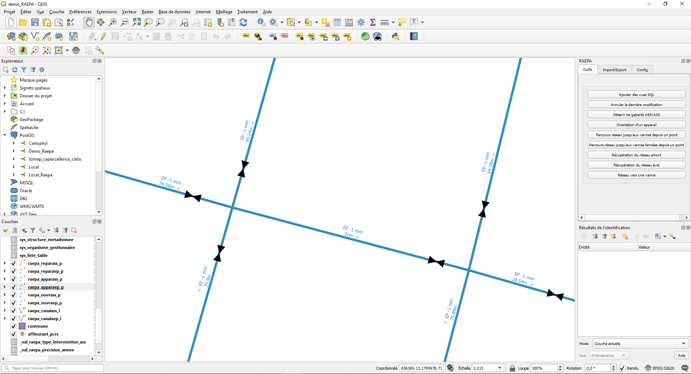

Les appareils sont bien orientés selon les canalisations !

##3. Annuler la dernière modification

Si vous vous souvenez bien, lorsque vous avez [installé la base de données](../Config/#12-installation-de-la-base) vous aviez la possibilité d'ajouter un
`Audit de suivi des modifications sur les tables`. Cet audit permet de garder en mémoire toutes les modifications effectuées sur la base.
Ainsi, si vous avez effectué une modification que vous désirez annuler dans la base (supposons par exemple que finalement vous ne vouliez pas calculer 
l'orientation de votre appareil), il vous suffit d'executer `annuler la dernière modification`
en renseignant la couche et l'identifiant (récupérable via l'outil `identifier les entités`  ou la
`table d'attribut` ) de l'objet sur lequel vous avez fait une modification indésirable.

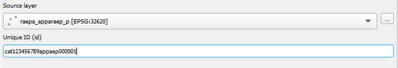

##4. Parcours réseau AEP

Comme vous devez le savoir, les réseaux humides sont répartis en deux grands types de sous réseau. Le plugin fournit, pour le premier d'entre eux,
le réseau d'Adduction d'Eau Potable (AEP), plusieurs outils d'analyse :

*(les outils suivants ont étés pensés pour fonctionner avec le réseau AEP du standard RAEPA.
Si vous l'utilisez avec un autre réseau, cela risque de ne pas fonctionner ou de donner un résultat inutilisable)*

###4.1. Parcours réseau jusqu'aux vannes depuis un point

Le réseau AEP est un réseau sous pression dont la forme ressemble souvent à celle d'une toile d'araignée. C’est-à-dire que pour aller d'un point A à un point B,
l'eau peut prendre plusieurs trajets. Ainsi pour administrer le réseau, et si besoin en isoler une partie du reste, un système de vanne est mis en 
place pour fermer au besoin les canalisations.

`Parcours réseau jusqu'aux vannes depuis un point` permet, depuis un point du réseau, de trouver toutes 
les vannes par lequel l'eau peut passer pour arriver à ce point.

Pour cela, lancez l'outil :

- vous pouvez définir le nom de la couche de résultat.

- Renseignez les coordonnées du point de départ du calcul sur le réseau ou cliquez sur  pour choisir le point de départ directement sur la carte 
(vous pouvez activer les [options d'accrochage](https://docs.qgis.org/3.16/fr/docs/user_manual/working_with_vector/editing_geometry_attributes.html#setting-the-snapping-tolerance-and-search-radius) pour faciliter le choix du point):
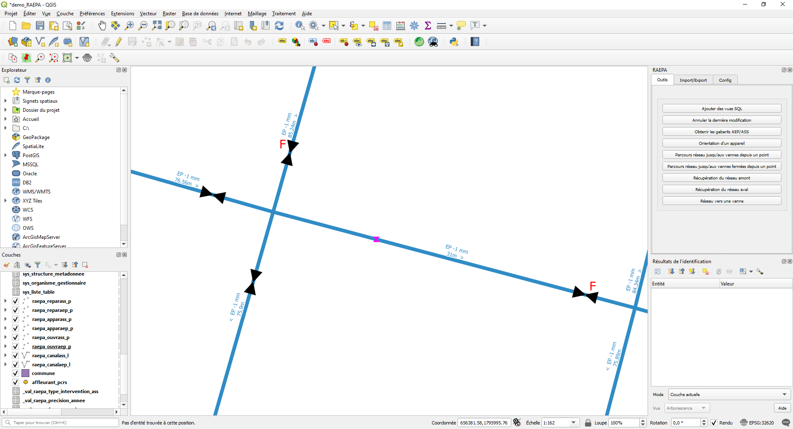
Il ne vous reste plus qu'à exécuter l'algorithme qui vous renvoie la partie du réseau qui contient ce point et qui est limitée par les vannes les plus proches :
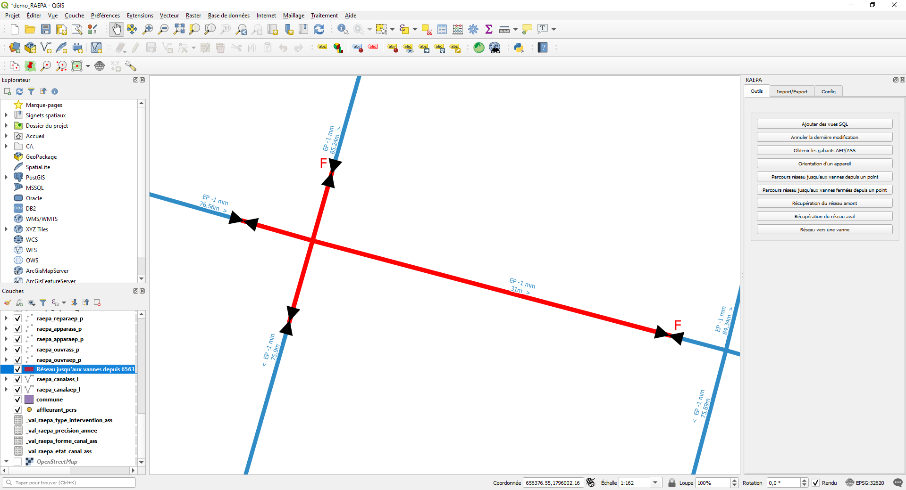

###4.2. Parcours réseau jusqu'aux vannes fermées depuis un point

L'outil `Parcours réseau jusqu'aux vannes fermées depuis un point` fonctionne de la même manière que [`Parcours réseau jusqu'aux vannes depuis un point`](#41-parcours-reseau-jusquaux-vannes-depuis-un-point)
à l'exception prêt qu'il ne prend pas en compte les vannes qui ne sont pas fermées.

Ainsi pour le même input que précédemment, le résultat sera :
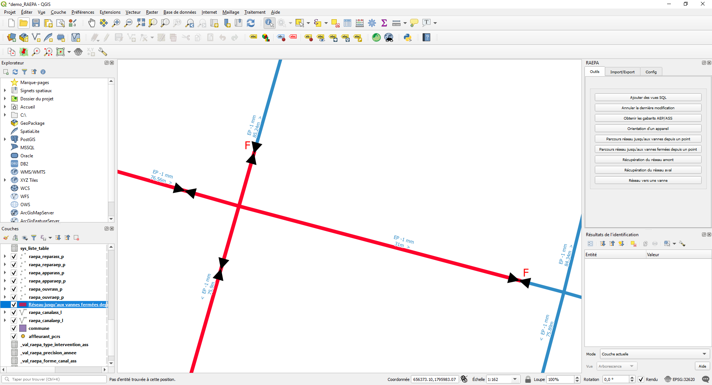

###4.3. Réseau vers une vanne

`réseau vers une vanne` permet lui aussi de déterminer quelles sont les vannes à fermer pour isoler une partie du réseau. Mais le point de départ 
du calcul n'est plus un point, mais une canalisation dont vous devez renseigner l'identifiant `idcana` (récupérable via l'outil `identifier les entités`  ou la
`table d'attribut` ).
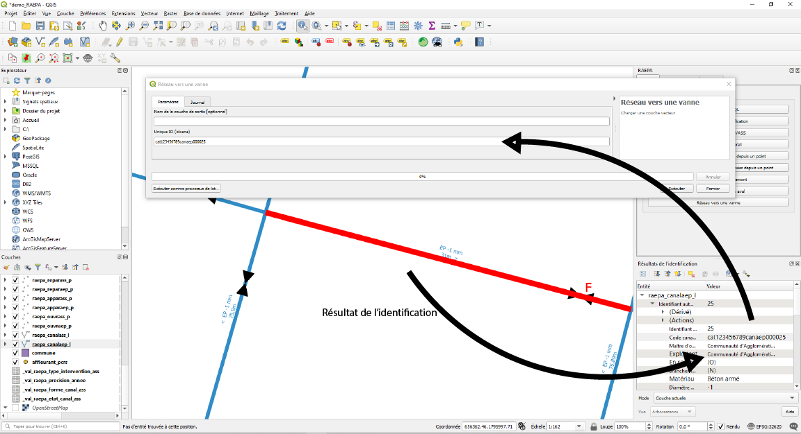

L'interêt de cet outil est de pouvoir isoler toute une canalisation même si une vanne se trouve sur celle-ci :

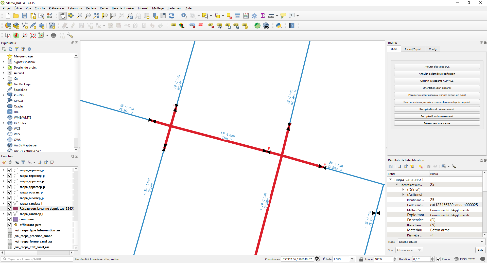

##5. Parcours réseau ASS

Le deuxième grand sous réseau, le réseau d'assainissement (ASS), est un réseau souvent gravitaire dont la forme ressemble à celle d'un arbre ou d'une rivière et ses affluents.
C'est à dire que pour aller d'un point A à un point B l'eau n'a qu'un seul chemin possible et ne peut aller que dans une direction. Dans ce réseau, le concept
d'aval et d'amont prend tout son sens.

*(les outils suivants ont étés pensés pour fonctionner avec le réseau ASS du standard RAEPA.
Si vous l'utilisez avec un autre réseau, cela risque de ne pas fonctionner ou de donner un résultat inutilisable)*

###5.1. Récupération du réseau amont

Ces deux outils (celui-ci et le suivant) permettent donc de déterminer quel a été le parcours en amont de l'eau qui passe en un point donné, et quel sera-t-il en aval.

`Récuperation du réseau amont` permet de retrouver toutes les canalisations par lesquelles peut passer l'eau avant d'arriver en un point donné.

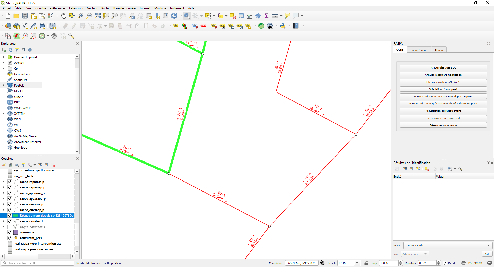

Le point de départ du calcul est un ouvrage du réseau dont vous renseignez l'identifiant `idouvrage` (récupérable via l'outil `identifier les entités`  ou la
`table d'attribut` ).

Si vous souhaitez partir d'un autre objet utilisez les [Actions](../Actions/).

###5.2. Récupération de réseau aval

De la même manière que `Récuperation du réseau amont`, `Récuperation du réseau aval` prend comme point de départ un ouvrage via son identifiant.

Si vous souhaitez partir d'un autre objet utilisez les [Actions](../Actions/).

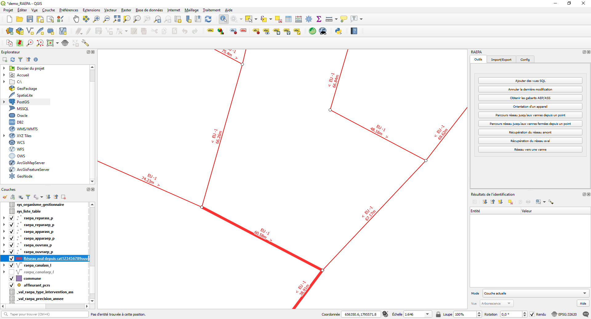

L'algorithme renvoie le parcours aval de l'eau arrivant depuis le point de départ.

##6. Ajouter des vue SQL

Enfin `Ajouter des vue SQL` vous permet d'ajouter une nouvelle couche au projet qgis résultant d'une requête SQL sur la base de donnée. 
C'est ce qu'on appelle une Vue. 

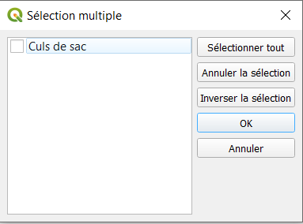

Par défault une seule vue est disponible pour cet outil (Elle permet de visualiser tous les culs de sac du réseau, c'est à dire une canalisation qui n'a ni ouvrage ni appareil à l'une de ses extrémités)
mais il est possible d'en ajouter :

Rendez-vous dans le [dossier d'extension de QGIS](https://docs.qgis.org/3.10/fr/docs/user_manual/plugins/plugins.html) puis dans `raepa\resources\sql_layer`.
Ici il vous suffit de créer un nouveau fichier `.sql` en suivant le formalisme du readme (Dans le dossier ci-dessus) et avec la requête sql que vous souhaitez.