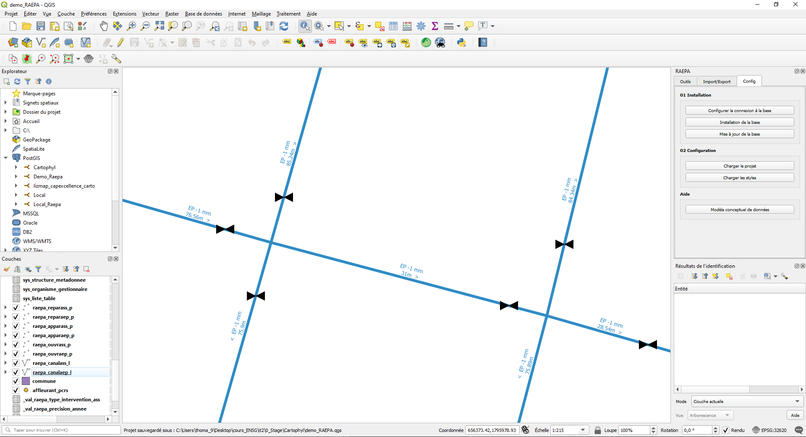

#Outils

Maintenant que votre base contient des données et que votre projet qgis est bien configuré, 
le plugin fourni un certain nombre d'outils pour le traitement et l'analyse des réseau humides. 

##__1. Obtenir les gabarits AEP/ASS__

Le bouton `Obtenir les gabarits AEP/ASS` permet de récupérer, dans un fichier `.zip`, les gabarits des différentes couches du standard :

Vous pouvez choisir entre les gabarits pour l'assainissement (ASS) ou l'adduction d'eau potable (AEP) ainsi que leur projection.
Vous pouvez aussi choisir le nom du fichier de sortie.

##__2. Orientation d'un appareil__

`Orientation d'un appareil` permet de calculer l'orientation de la canalisation support de l'appareil cible, l'interet est de pouvoir orienter
le symbole de l'appareil pourqu'il colle à la canalisation.

Cet appareil n'est pas orienté, vous pouvez utiliser `Orientation d'un appareil` pour calculer son orientation.
Pour cela vous avez besoin de connaitre son identifiant (ou d'utiliser une de ses [Actions](../Actions/)) grace à l'outil 
`identifier les entités`  ou la `table d'attribut` .
  après avoir renseigné l'indentifiant de l'appareil (idappareil) lancez l'algorithme, et vous obtenez ceci :

L'appareil est bien orienté selon la canalisation !

##__3. Annuler la dernière modification__

Si vous vous souvenez bien, lorsque vous avez [installé la base de données](../Config/#12-installation-de-la-base) vous aviez la possibilité d'ajouter un
`Audit de suivi des modifications sur les tables`. Cet audit permet de garder en mémoire toutes les modifications effectuées sur la base.
Ainsi, si vous avez effectué une modification que vous désirez annuler dans la base (supposons par exemple que finalement vous ne vouliez pas calculer 
l'orientation de votre appareil), il vous suffit d'executer `annuler la dernière modification`
en renseignant la couche et l'identifiant (récupérable via l'outil `identifier les entités`  ou la
`table d'attribut` ) de l'objet sur lequel vous avez fait une modification indésirable.

##__4. Parcours réseau AEP__

###__4.1. Parcours réseau jusqu'aux vannes depuis un point__

###__4.2. Parcours réseau jusqu'aux vannes fermées depuis un point__

###__4.3. Réseau vers une vanne__

##__5. Parcours réseau ASS__

###__5.1. Récupération du réseau amont__

###__5.2. Récupération de réseau aval__

##__6. Ajouter des vue SQL__

Enfin `Ajouter des vue SQL` vous permet d'ajouter une nouvelle couche au projet qgis résultant d'une requête SQL sur la base de donnée. 
C'est ce qu'on appelle une Vue. 

Par défault une seule vue est disponible pour cet outil (Elle permet de visualiser tous les culs de sac du réseau) mais il est possible d'en ajouter:
 Rendez-vous dans le [dossier d'extension de QGIS](https://docs.qgis.org/3.10/fr/docs/user_manual/plugins/plugins.html) puis dans `raepa\resources\sql_layer`.
Ici il vous suffit de créer un nouveau fichier `.sql` en suivant le formalisme du readme et avec la requête sql que vous souhaitez.