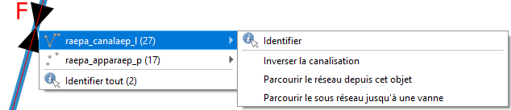
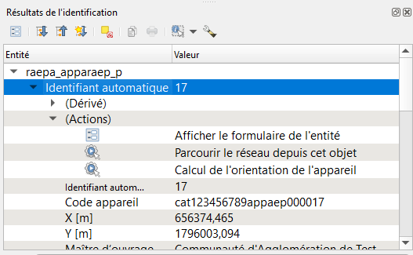
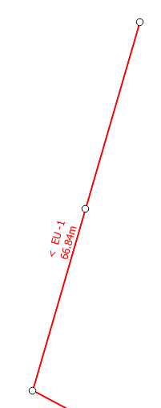
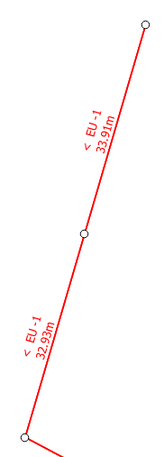
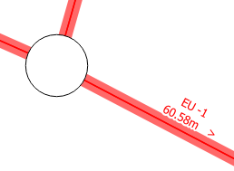
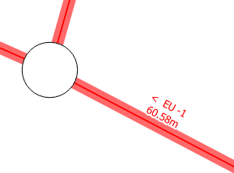
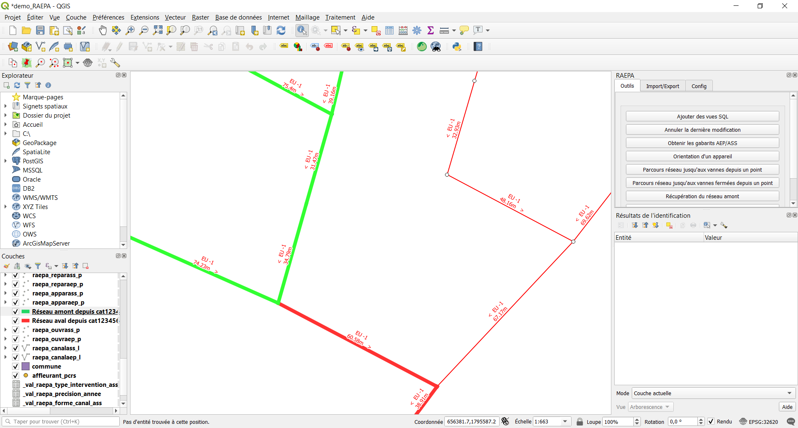

#Actions

##1. Mise en place

Pour pouvoir utiliser les actions disponibles via le plugin, il faut que vous les chargiez sur les différentes couches avec l'outil [Charger les styles](../config/#22-charger-les-styles).
Il suffit d'y cocher la case `action` ou `tout` dans le choix des styles.

##2. Utilisation

Une fois que vous avez chargé les styles, avec l'outil `identifier des entitées`  de Qgis vous pourrez
utiliser des fonctionnalités du plugin directement en cliquant sur les objets présents sur la carte.

- En effectuant un clic droit, vous avez directement accès aux actions disponibles :

  
- En effectuant un clic gauche vous y avez accès via le panneau [résultat de l'identification](https://docs.qgis.org/3.10/fr/docs/user_manual/introduction/general_tools.html#feature-information) :

##3. Les différentes actions

###3.1 annuler la dernière modification

*(N'est disponible que pour les ouvrages)*

Cette action fonctionne de la même manière que l'outil [`annuler la dernière modification`](../outils/#3-annuler-la-derniere-modification) 
Elle permet d'annuler la dernière modification de l'objet sur lequel vous avez cliqué. 

###3.2 couper la canalisation sous cet ouvrage

*(N'est disponible que pour les ouvrages)*

Permet, depuis un ouvrage se trouvant sur une canalisation unique, de découper cette canalisation en
deux tronçons de canalisation séparés par l'ouvrage. Dans l'exemple ci-dessous, la canalisation qui faisait à l'origine 
66m s'est coupée en deux canalisations d'une trentaine de mètre :

 

###3.3 inverser la canalisation

*(N'est disponible que pour les canalisations)*

Assurez-vous, avant d'utiliser cette action, de passer la couche souhaitée en mode édition,
sinon l'action ne fonctionnera pas et vous enverra un message d'erreur.

Cette action change le sens de la canalisation, elle permet de corriger des erreurs ou de mettre à jour les données après
une modification du réseau.

=>

###3.4 parcourir le réseau depuis cet objet

*(Disponible partout)*

Cette action execute les outils [`Récupération du réseau amont`](../outils/#51-recuperation-du-reseau-amont)
et [`Récupération de réseau aval`](../outils/#52-recuperation-de-reseau-aval) à partir de l'objet sélectionné :

###3.5 calcul de l'orientation de l'appareil

*(N'est disponible que pour les appareils)*

De la même manière que l'outil [`Orientation d'un appareil`](../outils/#2-orientation-dun-appareil) cette action permet de 
calculer l'orientation de la canalisation se trouvant sous l'appareil.

###3.6 Parcourir le sous réseau jusqu'à une vanne

*(N'est disponible que pour les canalisations)*

Fonctionne de la même manière que [`Réseau vers une vanne`](../outils/#43-reseau-vers-une-vanne), détermine la plus petite 
partie du réseau pouvant être isolée par des vannes et contenant la canalisation initiale. Ignore les vannes présentes
sur la canalisation initiale.