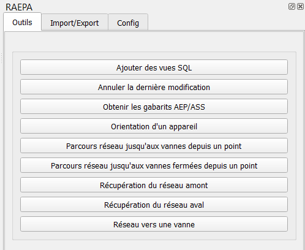

#Panneau RAEPA

Maintenant que vous avez installé le plugin dans Qgis, le panneau du plugin devrai être affiché :

Si ce n'est pas le cas, ou si vous le fermez, vous pouvez le réouvrir via le menu :

__Vue > Panneaux > RAEPA__
